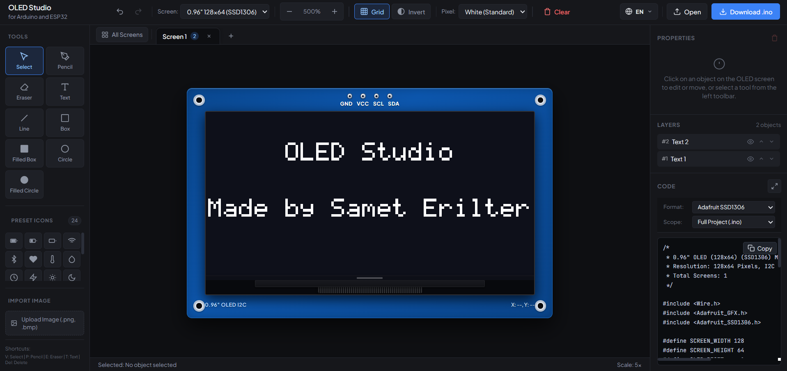

# OLED Studio



A lightweight, browser-based graphical user interface designer, pixel editor, and C++ code generator for monochrome OLED displays connected to Arduino, ESP32, ESP8266, and compatible microcontrollers.

---

## Overview

Designing user interfaces for small monochrome displays (such as 0.96-inch or 1.3-inch OLED modules) typically involves writing repetitive coordinate math by hand or relying on outdated single-image converters.

OLED Studio provides a desktop-grade visual editing environment inside the browser. It allows developers and makers to design multi-screen user interfaces, arrange text and geometry, convert graphics to monochrome bitmaps with real-time dithering, and immediately generate production-ready C++ code compatible with standard Arduino libraries.

The application runs entirely client-side using vanilla web technologies. It has no build pipeline, requires no package manager or server runtime, and functions completely offline.

---

## Technical Specifications

### Supported Displays and Controllers

| Profile | Resolution | Driver IC | Native Interface | Memory Page Layout |
| :--- | :--- | :--- | :--- | :--- |
| 0.96" OLED | 128 x 64 | SSD1306 | I2C (0x3C / 0x3D) / SPI | 8 pages x 128 columns (1 byte per column) |
| 1.30" OLED | 128 x 64 | SH1106 | I2C / SPI | 8 pages x 132 columns (offset by 2 pixels) |
| 0.91" OLED | 128 x 32 | SSD1306 | I2C | 4 pages x 128 columns |
| 0.66" OLED | 64 x 48 | SSD1306 | I2C | 6 pages x 64 columns |

### Architecture and Technology Stack

- Language: ECMAScript 2020 (Vanilla JavaScript)
- Styling: Pure CSS3 custom properties (dark engineering palette)
- Rendering Engine: Dual HTML5 Canvas system (base display buffer + interactive overlay canvas)
- Font Engine: Built-in 5x7 Adafruit GFX bitmap font matrix
- Persistence: LocalStorage for settings and state; JSON export/import for complete project definitions
- Dependencies: None

---

## Core Capabilities

### Multi-Screen Workflow and Artboard Overview

- Tab-based screen management: Create, duplicate, reorder, clear, and delete independent display screens.
- Global Artboard Overview: Zoom out into an interactive multi-display canvas to inspect all project screens side by side, rename them inline, or jump directly into any screen for editing.
- Automatic name synchronization: Default screen names update dynamically when toggling between languages (e.g., `Screen 1` to `Ekran 1`), while user-defined custom titles are preserved.

### Drawing and Editing Tools

- Select and Transform: Bounding box selection with drag handles for moving, resizing, and precision inspection.
- Freehand Pixel Pencil: Draw individual pixels with configurable pen sizes (1px, 2px, 3px, 4px).
- Dual Eraser Modes: Pixel-level precision eraser or one-click object eraser.
- Geometric Primitives: Lines, open rectangles, filled rectangles, open circles, and filled circles.
- Dynamic Text: Real-time text rendering with standard Adafruit GFX bitmap scaling (1x, 2x, 3x, 4x).
- Alignment Suite: Instant alignment to screen borders and center axes (Left, Center H, Right, Top, Center V, Bottom).
- Layers Panel: Full hierarchy management with visibility toggling, layer reordering (move up/down), and object deletion.

### Bitmap and Asset Importer

- Format Support: Import PNG, JPG, and BMP image files.
- Quantization Modes:
  - Fixed Threshold: Fast, high-contrast binary cutoff ideal for logos, line art, and typography.
  - Floyd-Steinberg Error Diffusion Dithering: Smooth grayscale simulation ideal for photographs and detailed graphics.
- Transformation Controls: Invert (negative) and real-time threshold adjustment.
- Asset Library: 84 embedded hardware, sensor, and UI icons (CPU/Chip, SD Card, Wi-Fi, Bluetooth, Signal/RF, Cloud, Battery, Gauges, EEPROM, GPS, Weather Sensors, Media Controls, Joystick, and Status indicators).

---

## Code Generation Targets

OLED Studio translates screen geometry and bitmap buffers directly into clean, compilable C++ code.

### 1. Complete Sketch (.ino)
Generates a standalone, flashable Arduino sketch containing:
- Hardware bus initialization (`Wire.h` / SPI setup)
- Display driver configuration
- Individual rendering functions for each screen (`drawScreen1()`, `drawScreen2()`, etc.)
- Central screen dispatcher (`showScreen(int index)`)
- Clean `setup()` and `loop()` routines ready for user application logic

### 2. Modular Header File (screens.h)
Exports all screen drawing functions and PROGMEM bitmap byte arrays into a self-contained header file. This keeps the primary `.ino` sketch organized:
```cpp
#include "screens.h"

void setup() {
  initDisplay();
  showScreen(0);
}
```

### 3. Active Screen Only
Produces a lightweight standalone function rendering only the currently selected screen. Useful for integrating a single UI view into an existing codebase.

### 4. Raw PROGMEM Byte Arrays
Extracts all project graphics as standard C byte arrays stored in microcontroller flash memory:
```cpp
static const unsigned char PROGMEM bmp_sensor_icon[] = {
  0x18, 0x3C, 0x7E, 0xFF, 0xE7, 0xC3, 0x81, 0x00
};
```

### Supported Libraries
- Adafruit SSD1306 and Adafruit GFX Library
- U8g2 Library (supporting both full buffer and page buffer picture loops)

---

## Project Structure

```text
ArduinoOledScreenEditor/
├── index.html          # Main application markup and UI layout
├── style.css           # Engineering UI stylesheet
├── i18n.js             # Dual-language localization engine (English / Turkish)
├── js/
│   ├── constants.js    # Display hardware profiles and 5x7 font tables
│   ├── state.js        # Central state, display buffer, and undo/redo stacks
│   ├── renderer.js     # Canvas drawing pipeline and pixel buffer math
│   ├── screens.js      # Screen tabs, tab context menus, and artboard overview
│   ├── editor.js       # Pointer events, shape tools, alignment, and layer tree
│   ├── icons.js        # Built-in sensor icon library and image dithering
│   ├── codegen.js      # C++ code generation engines for Adafruit and U8g2
│   └── app.js          # Application bootstrap, hotkeys, and JSON storage
├── README.md           # Documentation
└── LICENSE             # MIT License
```

---

## Getting Started

### Local Setup
No compilation, installation, or local server configuration is necessary.

1. Clone or download the repository:
   ```bash
   git clone https://github.com/SametERILTER/Arduino-Oled-Studio.git
   cd Arduino-Oled-Studio
   ```
2. Double-click `index.html` to open it in Google Chrome, Mozilla Firefox, Microsoft Edge, or Safari.

### Running via GitHub Pages
1. Fork or push this repository to your GitHub account.
2. In your repository, navigate to **Settings** > **Pages**.
3. Under **Branch**, select `main` and set the folder to `/(root)`.
4. Click **Save**. Your editor will be accessible online through your GitHub Pages URL.

---

## Keyboard Shortcuts

| Key Combination | Action |
| :--- | :--- |
| `Ctrl + Z` / `Cmd + Z` | Undo last operation |
| `Ctrl + Y` / `Cmd + Y` | Redo last undone operation |
| `V` | Switch to Select / Transform tool |
| `P` | Switch to Pixel Pencil |
| `E` | Switch to Eraser |
| `T` | Switch to Text tool |
| `L` | Switch to Line tool |
| `R` | Switch to Rectangle tool |
| `C` | Switch to Circle tool |
| `Delete` / `Backspace` | Remove selected object |
| `Arrow Keys` | Nudge selected element by 1 pixel |
| `Shift + Arrow Keys` | Nudge selected element by 5 pixels |
| `Escape` | Dismiss modal dialogs, context menus, or Artboards overview |

---

## Roadmap

Features and capabilities currently under development or scheduled for upcoming releases:

- [x] Multi-screen tab manager with dynamic title translation
- [x] Zoomable multi-screen Artboard overview
- [x] Real-time Floyd-Steinberg dithering and image importer
- [x] Adafruit GFX and U8g2 C++ code generation
- [x] Offline project save and load via structured JSON
- [ ] Web Serial API integration for live USB screen streaming directly to hardware
- [ ] Multi-frame animation editor with framerate control and animated GIF/Sprite sheet export
- [ ] Custom BDF and TrueType (TTF) font converter to PROGMEM character tables
- [ ] Vector Bezier curves, arcs, and arbitrary polygon drawing tools
- [ ] Run-Length Encoding (RLE) and LZ-based bitmap compression for memory-constrained MCUs (ATmega328P)
- [ ] Interactive widget library (rotary gauges, horizontal/vertical progress bars, switch toggles)
- [ ] Code syntax highlighting and integrated single-click flash tool via WebAssembly avr-gcc

---

## Contributing and Feedback

Contributions, bug reports, and feature proposals are welcome.

### Submitting Issues
If you encounter a bug, incorrect code generation output, or display compatibility issues:
1. Open an issue on GitHub.
2. Provide display details (resolution, driver model, controller board).
3. Include your exported project JSON file or a screenshot illustrating the behavior.

### Pull Requests
1. Fork the repository.
2. Create a dedicated branch for your feature or bug fix:
   ```bash
   git checkout -b feature/your-feature-name
   ```
3. Commit your changes with clear, descriptive commit messages.
4. Push your branch and open a Pull Request against `main`.

---

## Contact

This project is currently under active development. If you encounter any issues, have feature requests, or want to contribute feedback regarding display support and code generation:

- Email: sametbilal34@gmail.com

---

## License

This project is licensed under the [MIT License](LICENSE). You are free to use, modify, distribute, and integrate this software into open-source or commercial hardware projects.
